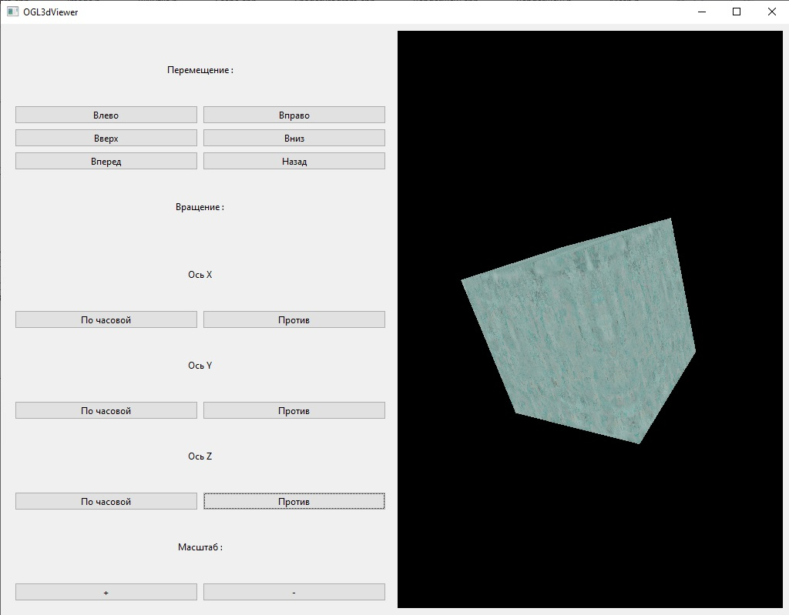

# OGL3dViewer

Пет-проект: 3D-просмотрщик на OpenGL с использованием Qt 6 и современного C++23.

---

## 📖 О проекте

**OGL3dViewer** — учебный проект по 3D-графике на OpenGL. 

На текущий момент реализован базовый рендеринг: отображается куб с текстурой, 
который можно двигать, вращать по всем осям и масштабировать с помощью кнопок Qt. 

Цель проекта — изучение современного OpenGL (Core Profile 3.3+), 
архитектуры приложений на C++ и чистой архитектуры с разделением слоёв.

---

## ✨ Возможности

- ✅ Рендеринг 3D-куба через OpenGL 3.3 Core Profile
- ✅ Текстурирование через `stb_image`
- ✅ Трансформации модели: перемещение, вращение, масштабирование
- ✅ Управление через кнопки Qt
- ✅ Разделение матриц Model / View / Projection
- ⏳ Загрузка внешних моделей (OBJ, FBX) — в планах
- ⏳ Освещение (Phong / PBR) — в планах

---

## 🏗 Архитектура

Проект построен с разделением на слои. Зависимости идут сверху вниз, 
нижние слои не знают о верхних.

### Принципы

- **Dependency Inversion** — зависимости через интерфейсы (`IView`, `IScene`, `ISceneProvider`)
- **Single Responsibility** — каждый класс отвечает за одну задачу
- **RAII** — управление ресурсами через `std::unique_ptr`
- **Separation of Concerns** — UI не знает о Model, Model не знает о UI

---

## 🛠 Технологии

| Технология | Версия | Назначение |
|------------|--------|------------|
| C++ | 23 | Язык разработки |
| CMake | 3.29+ | Система сборки |
| Qt | 6 | GUI, окна, ввод |
| OpenGL | 3.3+ Core | Рендеринг |
| GLEW | 2.1 | Загрузка функций OpenGL |
| stb_image | latest | Загрузка текстур |

---

## 📋 Требования

- **Компилятор:** MSVC 2022+ / GCC 12+ / Clang 15+
- **CMake:** 3.29+
- **Qt:** 6.x
- **OpenGL:** 3.3+ (Core Profile)
- **GLEW:** 2.1+
- **OS:** Windows (проверено), Linux / macOS — теоретически должны работать

---

## 🚀 Сборка

### Windows (Visual Studio 2022)

```bash
# 1. Клонировать репозиторий
git clone https://github.com/username/OGL3dViewer.git
cd OGL3dViewer

# 2. Открыть в Visual Studio
# File → Open → Folder...

# 3. Выбрать конфигурацию Qt-Debug или Qt-Release

# 4. Собрать (Ctrl+Shift+B)```
